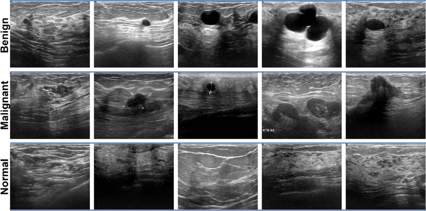

# Breast Cancer Ultrasound Image Classification - Xception CNN
<p align="center">
  <em>Proposed by Mr. AATILA Mustapha</em>
</p>

<p align="center">
  
</p>
<p align="center">
  
  
  
  
</p>

This project proposes a deep learning approach for automated histopathological classification of breast tissue images. By leveraging the Xception architecture based on depthwise separable convolutions, the system performs ternary classification distinguishing **benign**, **malignant**, and **normal** tissues. The approach integrates a rigorous preprocessing pipeline, medical domain-adapted data augmentation strategies, and comprehensive quantitative evaluation of model performance.

## ------Contributors------


<table align="center">
  <tr>
    <td align="center" style="padding: 20px;">
      <a href="https://github.com/hibadash">
        <br>
        <sub><b>DADDA Hiba</b></sub>
      </a>
    </td>
    <td align="center" style="padding: 20px;">
      <a href="https://github.com/zohrae">
        <br>
        <sub><b>LAMSSANE Fatima</b></sub>
      </a>
    </td>
    <td align="center" style="padding: 20px;">
      <a href="https://github.com/kawtar-Berr">
        <br>
        <sub><b>BERROUCH Kawtar</b></sub>
      </a>
    </td>
  </tr>
</table>


## Installation

Clone the repository and install dependencies:

```bash
git clone https://github.com/hibadash/Breast-Ultrasound-Classification-Using-Xception-CNN-BUSI-Dataset.git
cd Breast-Ultrasound-Classification-Using-Xception-CNN-BUSI-Dataset
pip install -r requirements.txt
```

---

## Overview of Images to Classify (Ultrasound Type)



---

## Features

- **Multi-class classification (3 classes)**: Distinction between benign, malignant, and normal tissues
- **Xception architecture**: Convolutional neural network pre-trained on ImageNet
- **Automated preprocessing**: Image resizing and normalization
- **Data augmentation**: Rotation, zoom, and flip to improve generalization
- **Comprehensive evaluation metrics**: Accuracy, confusion matrix, ROC curves, and AUC

---

## Dataset

The model is trained on breast tissue ultrasound images from the BUSI dataset:

| Class | Description |
|--------|-------------|
| **Normal** | Healthy breast tissue |
| **Benign** | Non-cancerous tumors (fibroadenomas, cysts) |
| **Malignant** | Cancerous tumors (carcinomas) |

**Data distribution:** 70% training, 15% validation, 15% test

---


</table>

<p align="center">
  <i>Developed at Cadi Ayyad University – Faculty of Sciences Semlalia, Marrakech</i><br>
  <i>2025</i>
</p>

---

